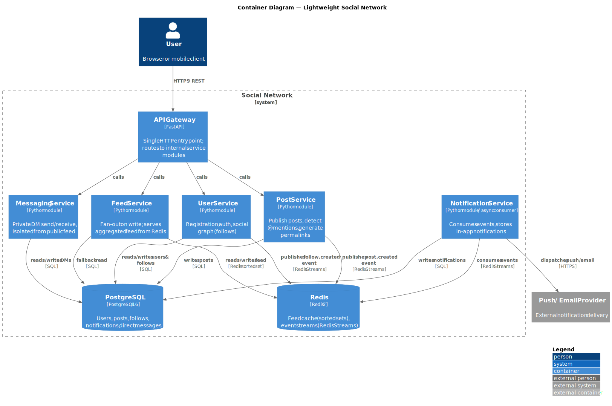
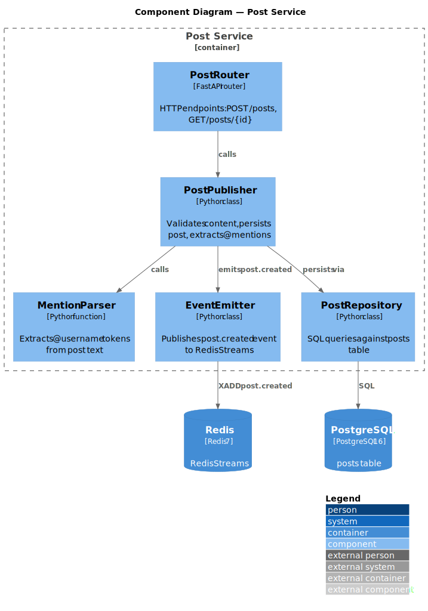
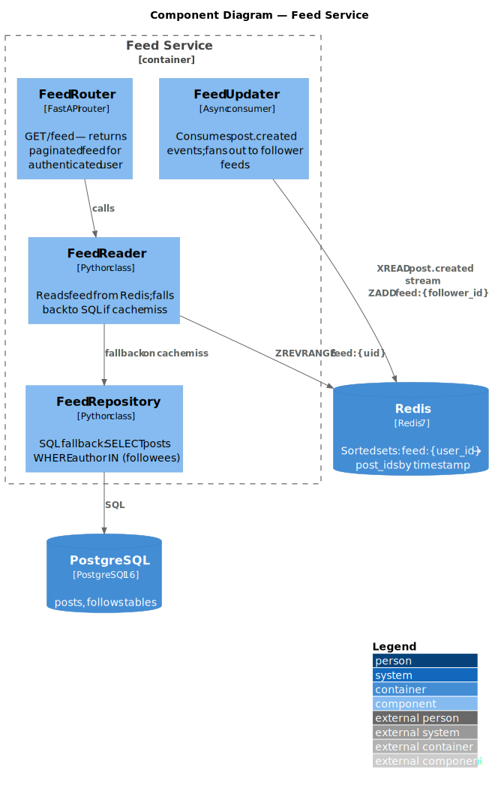

# Chapter 5: Building Block View

## 5.1 Level 1 — Containers

The system is decomposed into five logical service modules behind a single FastAPI gateway, backed by PostgreSQL and Redis.

| Container           | Responsibility                                                        |
|---------------------|-----------------------------------------------------------------------|
| API Gateway         | Single HTTP entry point; authentication middleware; routes requests   |
| User Service        | User accounts, social graph (follows/unfollows)                       |
| Post Service        | Publish posts, detect @mentions, emit events                          |
| Feed Service        | Fan-out on write; serve aggregated feed from Redis                    |
| Notification Service| Async consumer; stores in-app notifications; dispatches push/email    |
| Messaging Service   | Private DMs; strictly isolated from public post tables                |
| PostgreSQL          | Source of truth for all persistent data                               |
| Redis               | Feed cache (sorted sets) + event bus (Streams)                        |

## 5.2 Level 2 — Post Service Components

Key flow: `Post Router → Post Publisher → Mention Parser + Post Repository + Event Emitter`

The `Event Emitter` publishes a `post.created` event containing `{post_id, author_id, mentioned_user_ids}`.

## 5.3 Level 2 — Feed Service Components

Key flow (write): `Feed Updater` consumes `post.created`, fetches the author's followers from PostgreSQL, and fans out by writing the post ID into each follower's Redis sorted set (`ZADD feed:{follower_id} <timestamp> <post_id>`).

Key flow (read): `Feed Reader` does `ZREVRANGE feed:{uid}` on Redis; on cache miss it falls back to a SQL query.

## 5.4 Data Isolation Rule

Direct messages (`messages` table) are owned exclusively by the Messaging Service. No other service queries this table. The Post Service and Feed Service have no foreign keys or joins to `messages`.
