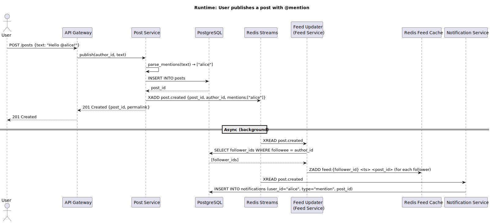
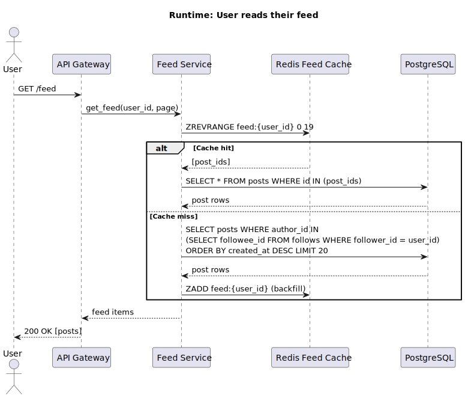
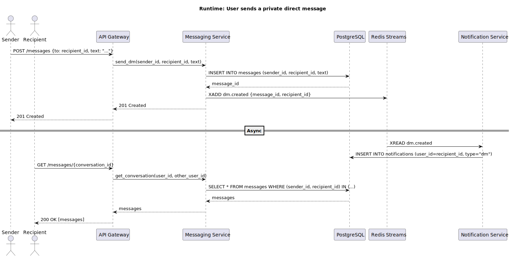

# Chapter 6: Runtime View

## 6.1 Scenario: Publish a Post with @mention

**Key points:**
- The HTTP response returns as soon as the post is persisted and the event is enqueued — the user is not blocked by feed fan-out or notification delivery.
- Feed fan-out and notification creation happen asynchronously via Redis Streams consumers.
- If the Notification Service is down, the event remains in the stream and is processed on recovery (Redis Streams consumer groups provide at-least-once delivery).

## 6.2 Scenario: Read Feed

**Key points:**
- Happy path is a single Redis `ZREVRANGE` + a batched `SELECT IN` — two fast operations.
- SQL fallback is triggered only on cold start or cache eviction; it also backfills the cache.

## 6.3 Scenario: Send and Receive a Direct Message

**Key points:**
- DMs are written exclusively to the `messages` table; no post or feed table is touched.
- The recipient is notified asynchronously via the same Notification Service used for @mentions.
- DM retrieval is a direct SQL query scoped to the two participants — no Redis involvement.
