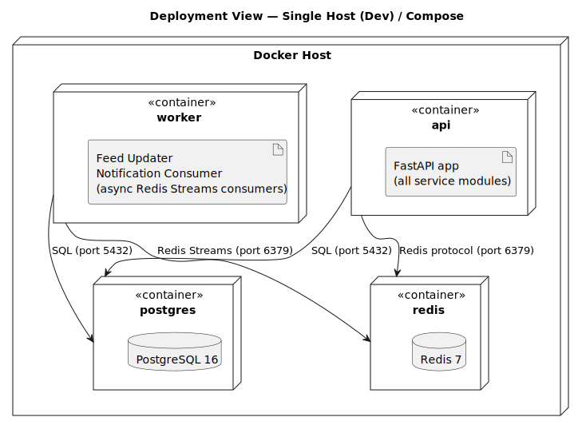

# Chapter 7: Deployment View

## 7.1 Target Environment

For this exercise the target is a single-host Docker Compose deployment. The architecture does not preclude moving to Kubernetes later — the container split already maps to independent deployable units.

## 7.2 Deployment Diagram

## 7.3 Container Mapping

| Docker Service | Contents                                              | Exposed Port |
|----------------|-------------------------------------------------------|--------------|
| `api`          | FastAPI app with all service modules                  | 8000         |
| `worker`       | Feed Updater + Notification Consumer (async consumers)| —            |
| `postgres`     | PostgreSQL 16                                         | 5432 (internal) |
| `redis`        | Redis 7                                               | 6379 (internal) |

## 7.4 Scaling Notes

- `api` is stateless — scale horizontally behind a load balancer.
- `worker` consumers use Redis Streams consumer groups; multiple instances share the load without duplicate processing.
- `postgres` is a single instance for this scope; read replicas can be added for feed SQL fallback reads.
