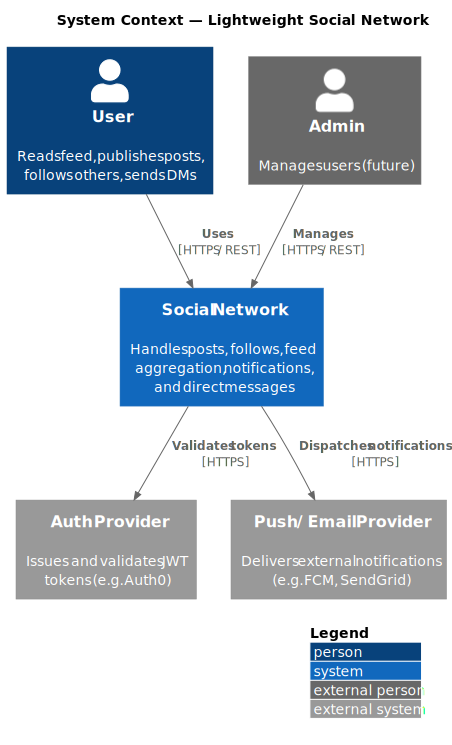

# Chapter 3: System Scope and Context

## 3.1 System Scope

The system provides public short-message posting, social following, feed aggregation, @mention notifications, and private direct messaging. Everything runs within a single deployable unit backed by PostgreSQL and Redis.

## 3.2 Context Diagram

## 3.3 External Actors

| Actor            | Interaction                                                      |
|------------------|------------------------------------------------------------------|
| User (browser/app) | Reads feed, publishes posts, follows users, sends DMs          |
| Email / Push provider | Receives notification dispatch requests (future extension) |

## 3.4 System Boundaries

**Inside scope:**
- User accounts and social graph
- Post publishing and feed generation
- @mention detection and in-app notifications
- Private direct messaging

**Outside scope:**
- Third-party identity providers (OAuth/OpenID integrations)
- Email / push delivery (fire-and-forget call to external provider)
- Media / image hosting
